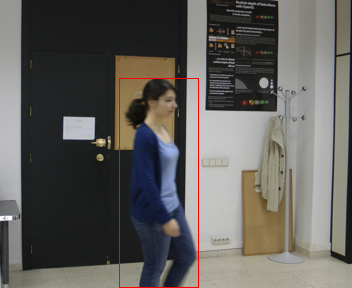
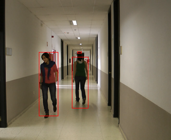
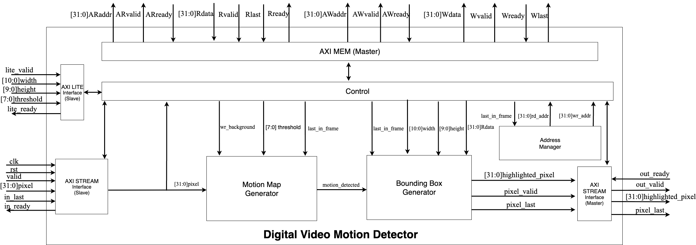
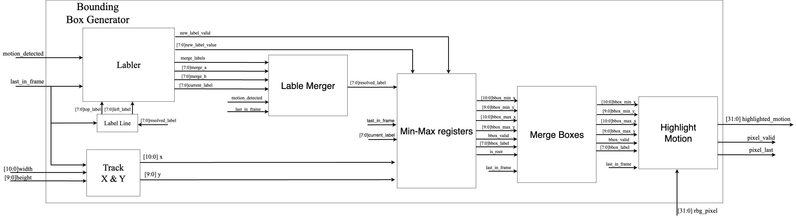
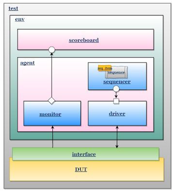
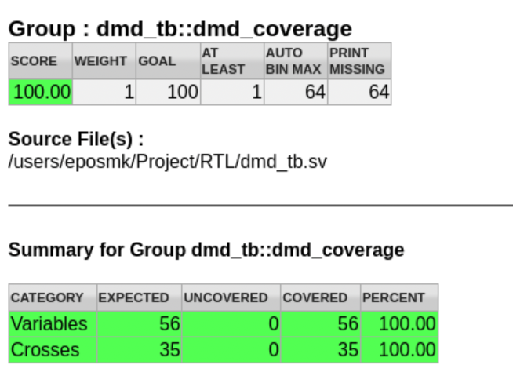

# Hardware for Digital Video Motion Detector


Real-time hardware motion detection with AXI-Stream I/O, AXI-Lite configuration, and AXI memory access. Two-frame latency, UVM-verified, with a Python golden model.

## Table of Contents

- [Overview](#overview)
- [Quick Demo](#quick-demo)
- [Key Features](#key-features)
- [Architecture](#architecture)
- [Algorithm](#algorithm)
- [Verification](#verification)
- [Project Structure](#project-structure)
- [Getting Started](#getting-started)
  - [Simulation & Verification](#simulation--verification)
  - [Python Reference Model](#python-reference-model)
- [Python Requirements](#python-requirements)
- [Results](#results)
- [License](#license)

---

## Overview

This project implements a **hardware-oriented Digital Video Motion Detector**. It was designed to bridge the gap between algorithmic motion detection and realistic RTL implementation.

Motion detection is a core building block in surveillance systems, smart traffic monitoring, and embedded vision pipelines. This design focuses on a lightweight, efficient pipeline validated using **industry-standard UVM methodology**.

---

## Quick Demo

| Single Object | Multiple Objects |
| --- | --- |
|  |  |

Demo video: [docs/demo.mp4](docs/demo.mp4)

---

## Key Features

### Hardware Design
*   **Efficient Pipeline:** Frame-based processing tailored for real-time video flow.
*   **Modular RTL:** Clear separation between datapath and control using SystemVerilog.
*   **Parameterized:** Configurable resolution and thresholding.
*   **Standard Interfaces:** AXI-Stream for video, AXI-Lite for configuration, AXI for frame memory.

### Algorithmic Core
*   **Sigma-Delta Detection:** Integer-only algorithm suitable for hardware synthesis.
*   **Background Modeling:** Dynamic background update mechanism.
*   **Bounding Box Extraction:** Hardware-friendly logic to merge motion pixels into spatial regions.

### Verification & Modeling
*   **UVM Environment:** Comprehensive testbench with drivers, monitors, and scoreboards.
*   **Python Reference:** Bit-accurate software model for algorithm exploration and verification.

---

## Architecture

The system processes video frames to produce a **binary motion map** and high-level **bounding boxes**.



**Pipeline Stages:**
1.  **Frame Acquisition:** Ingests video stream.
2.  **Background Modeling:** Maintains a running estimate of the static background.
3.  **Motion Detection:** Compares current frame to background (Sigma-Delta).
4.  **Motion Map:** Generates a binary mask of moving pixels.
5.  **Bounding Boxes:** Aggregates motion pixels into rectangular coordinates.

---

## Algorithm

### Sigma-Delta + Two-Frame Differencing

The core engine uses a modified **Sigma-Delta** algorithm combined with **two-frame differencing**. It maintains both a **Background** model and a **Variance (Sigma)** estimate.

**Motion Logic:**
A pixel is marked as motion only if **both** conditions are met:
1.  **Temporal Difference:** `|current - previous| > threshold` (Filters out slow changes)
2.  **Background Deviation:** `|current - background| >= variance` (Filters out noise)

**Update Logic:**
*   **Background:** Incremented/Decremented by 1 towards current pixel.
*   **Variance:** Incremented/Decremented by 2 towards the current deviation.


### Bounding Box Extraction

The bounding box block converts unstructured motion pixels into spatial regions using a hardware-optimized **Connected Component Labeling (CCL)** approach.

**Key Hardware Features:**
*   **Single-Pass Labeling:** Assigns labels on-the-fly using a line buffer (checks Left/Top neighbors).
*   **Ping-Pong Banking:** Uses 4 memory banks to pipeline the stages:
    1.  **Accumulate:** Update min/max coordinates for each label.
    2.  **Filter/Merge:** Merge overlapping bounding boxes.
    3.  **Output:** Highlight pixel edges based on active boxes.
    4.  **Clear:** Reset bank for reuse.



---

## Verification

*   **UVM Environment:** Dedicated drivers, monitors, sequencers, and scoreboards per block.
*   **Assertions (SVA):** Protocol and internal checks for safety and correctness.
*   **Functional Coverage:** `dmd_tb::dmd_coverage` reached 100% (56 variables, 35 crosses).





---

## Project Structure

The repository is organized to separate Synthesizable RTL, Verification methods, and Documentation.

```text
.
├── rtl/                                     # Synthesizable Design
│   ├── Digital_Motion_Detector.sv           # Top Level
│   ├── addr_manager.sv
│   └── motion_pipeline/                     # Pipeline Stages
│       ├── motion_map_generator/
│       └── bounding_boxes/
├── dv/                                      # Verification
│   ├── uvm/                                 # UVM Testbenches
│   │   ├── dmd/                             # Top-Level TB
│   │   └── motion_pipeline/                 # Unit TBs
│   └── python/                              # Reference Model
│       ├── sim.py                           # Main simulation CLI
│       └── Testcases/
└── docs/                                    # Images & Documentation
```

---

## Getting Started

### Simulation & Verification

To run the full UVM regression on the top-level design:

```bash
cd dv/uvm/dmd
make x
```

This will compile the RTL and Testbench using VCS and run the default test case.

### Python Reference Model

The Python model serves as the "Golden Reference". You can run it via the unified CLI:

```bash
# General help
python3 dv/python/sim.py --help

# Run Sigma-Delta algorithm on all testcases
python3 dv/python/sim.py run --algorithm sigma_delta

# Create a video from output frames
python3 dv/python/sim.py video output_folder/ result.mp4
```

---

## Python Requirements

```bash
pip install numpy opencv-python pillow scikit-learn
```

---

## Results

The selected algorithm (Sigma-Delta + two-frame differencing) was evaluated on 10 test scenes using pixel-level precision/recall metrics.

| Test | Precision [%] | Recall [%] | F1 [%] |
| --- | --- | --- | --- |
| Test1 | 79 | 82 | 74 |
| Test2 | 86 | 57 | 61 |
| Test3 | 60 | 71 | 63 |
| Test4 | 88 | 94 | 91 |
| Test5 | 73 | 83 | 76 |
| Test6 | 60 | 84 | 71 |
| Test7 | 65 | 81 | 73 |
| Test8 | 75 | 88 | 80 |
| Test9 | 62 | 72 | 66 |
| Test10 | 65 | 68 | 66 |
| Average | 74.3 | 78.2 | 74.4 |

For reference, a baseline method (Background Subtraction + Three-Frame Differencing) achieved an average **F1 = 59.4**.

---

## License

This project was developed for academic purposes at the Technion – Israel Institute of Technology. Provided for educational and demonstration purposes. See `LICENSE`.
