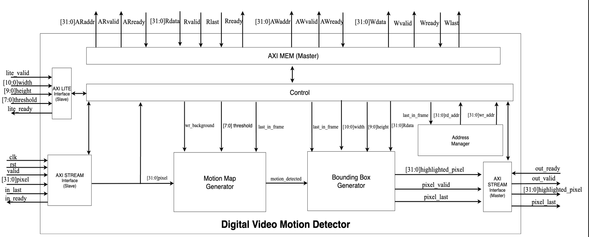
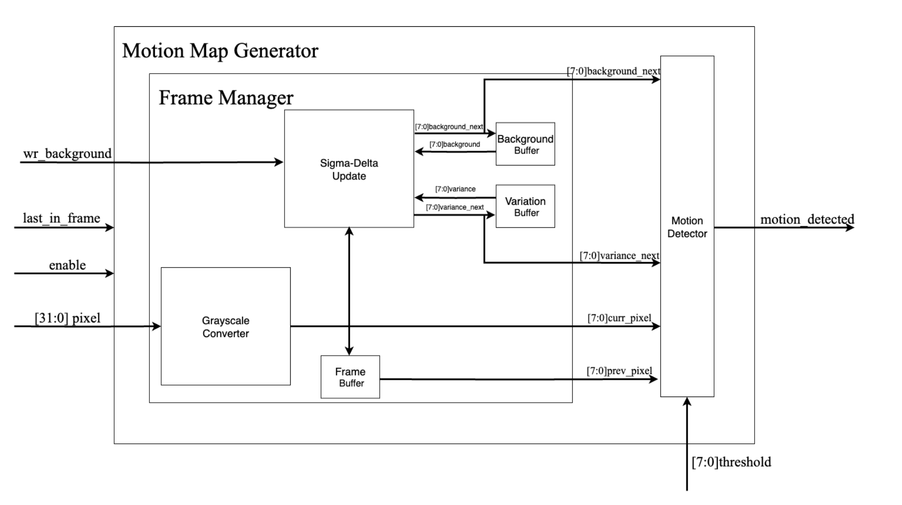
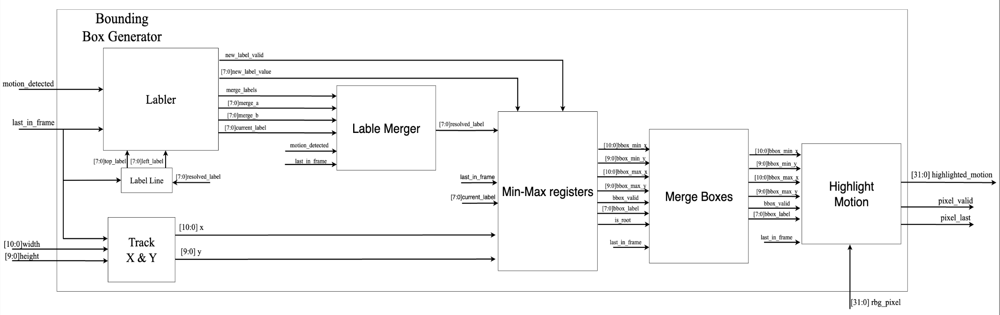

# Hardware for Digital Video Motion Detector

This repository contains the final implementation and verification of a **Digital Video Motion Detector** project, developed and submitted as an academic hardware design project at the Technion – Israel Institute of Technology.

The project focuses on designing a **hardware-oriented motion detection pipeline**, validating it using **UVM-based verification**, and supporting the design with **Python reference simulations** for algorithm exploration and verification alignment.

This README is based directly on the **final written report** and **final presentation** that were submitted with the project.

---

## Project Motivation

Motion detection is a core building block in many video-processing systems such as:
- Surveillance cameras  
- Smart traffic systems  
- Embedded vision pipelines  

The goal of this project was to:
- Design a **realistic motion detection hardware block**
- Implement the algorithm in a way that is suitable for RTL realization
- Verify correctness using **industry-standard UVM methodology**
- Compare hardware behavior against a software reference model

---

## High-Level Architecture

The system processes video frames and produces a **binary motion map** highlighting regions where motion is detected.

At a high level, the pipeline includes:
1. Frame acquisition
2. Background modeling
3. Motion detection using a **Sigma-Delta algorithm**
4. Motion map generation
5. Bounding box extraction

The design is structured as a pipeline to allow future expansion and optimization.

---

## Motion Detection Algorithm (Sigma-Delta)

The motion detector is based on a **Sigma-Delta background subtraction algorithm**, chosen because it:
- Is computationally lightweight
- Uses only integer arithmetic
- Is well suited for hardware implementation

For each pixel:
- A background estimate is maintained
- The estimate is slowly updated toward the current pixel value
- The absolute difference between the current pixel and background is compared against a threshold
- Pixels exceeding the threshold are marked as motion

The algorithm operates on a frame-by-frame basis and produces a motion mask.

---

## Bounding Box

After generating the binary motion map, the next stage of the pipeline is **bounding box extraction**.

The purpose of this block is to convert low-level pixel motion information into **higher-level spatial objects** that describe *where* motion is occurring in the frame. Instead of working with thousands of individual motion pixels, the system outputs rectangular regions that tightly enclose moving areas.

---

## RTL Design

The RTL implementation is written in **SystemVerilog** and structured in a modular way:
- Clear separation between datapath and control
- Frame-based processing model
- Parameterized design where possible

The motion detector can be integrated as a standalone block or as part of a larger video processing system.

---

## Verification Methodology (UVM)

Verification is implemented using **Universal Verification Methodology (UVM)**.

The UVM environment includes:
- Transactions representing pixel and frame data
- Drivers that stimulate the DUT
- Monitors that sample DUT outputs
- Scoreboards that compare DUT results with expected behavior
- Sequences and tests covering different motion scenarios

The verification environment is designed to be **scalable and reusable**, following standard UVM best practices.

---

## Python Simulation and Reference Model

Alongside the RTL design, a **Python reference model** is provided to:
- Prototype the motion detection algorithm
- Generate expected motion maps
- Compare software results against RTL outputs
- Evaluate detection quality using metrics such as precision, recall, and F1 score

The Python simulations were also used during development to tune algorithm parameters before RTL implementation.

---

## Results and Evaluation

The final evaluation compares motion detection results across multiple test scenarios.

Metrics used include:
- Precision
- Recall
- F1 score

The results demonstrate that the hardware-oriented Sigma-Delta implementation successfully detects motion while maintaining reasonable accuracy, given the constraints of a hardware-friendly algorithm.

---

## Repository Contents

Typical contents of this repository include:
- RTL source files (SystemVerilog)
- UVM testbench and verification components
- Python simulation and reference model
- Makefiles and scripts for simulation
---

## Author

Developed as part of an academic hardware design and verification project.

---

## License

This repository is provided for educational and demonstration purposes.
